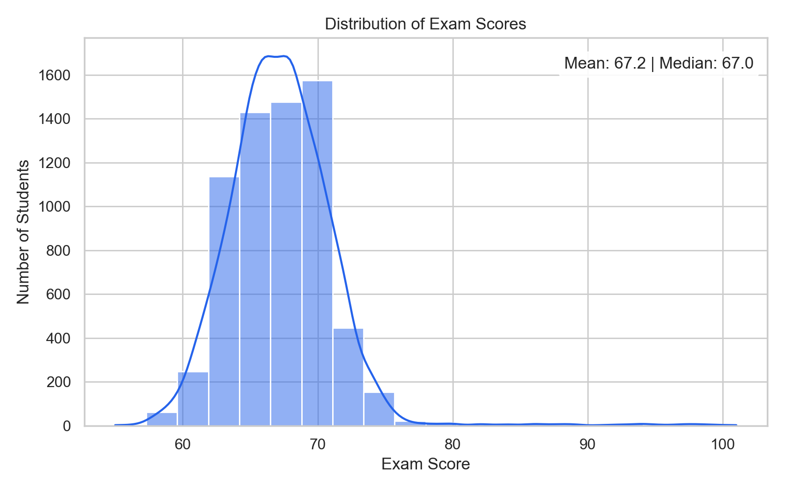
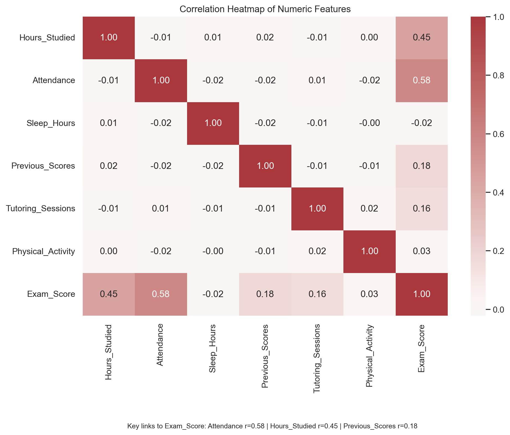
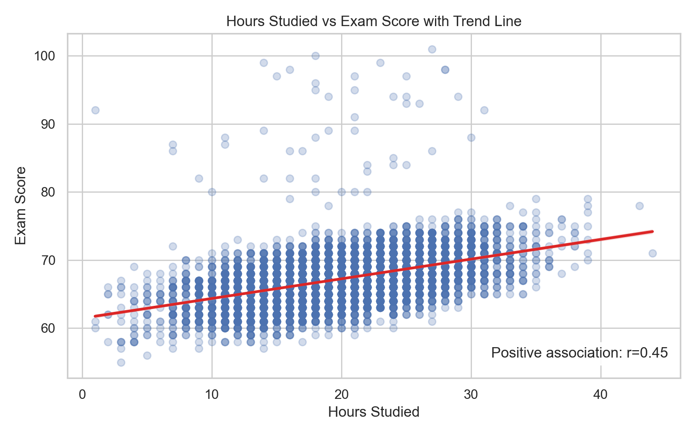
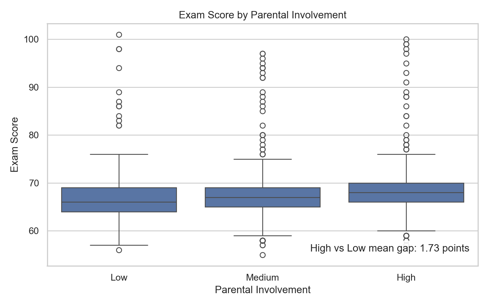
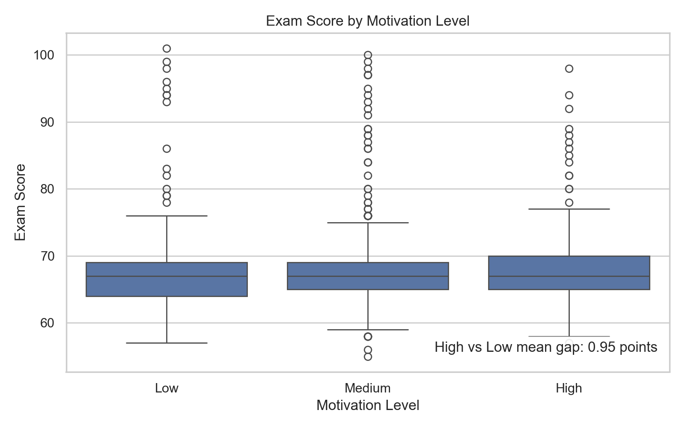
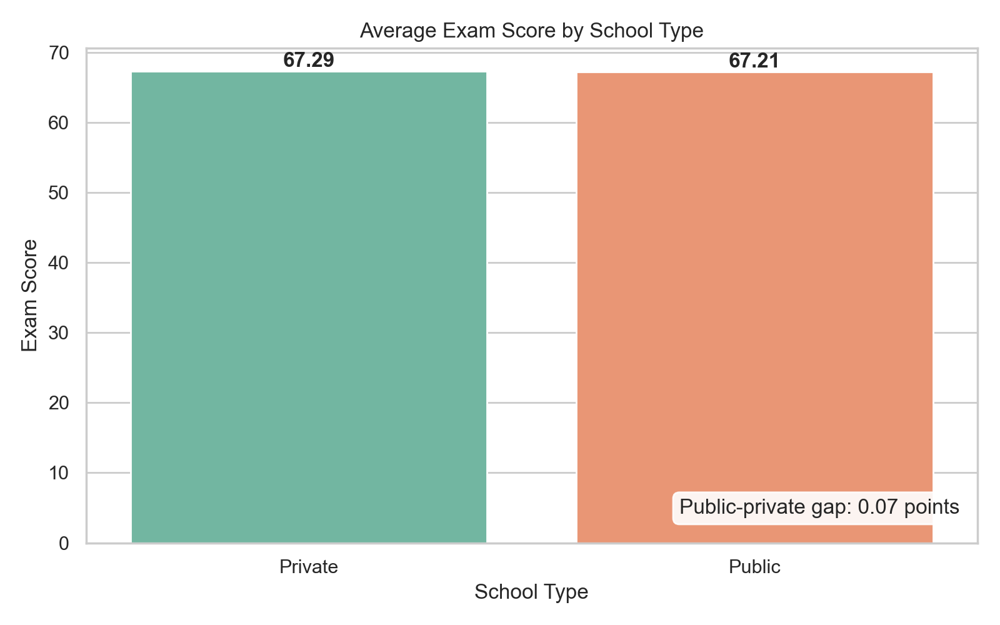

# Student Performance Factors Analysis & Predictive Modeling
### Brief One Line Summary
An end-to-end data analytics and machine learning project predicting student exam performance using demographic, behavioral, and academic features.

## Overview
This portfolio project examines the factors associated with student exam performance and builds reproducible regression models to predict `Exam_Score`. The workflow moves from data quality checks and imputation through exploratory analysis, categorical encoding, model training, evaluation, and automated report generation. It demonstrates practical data science skills in an education analytics setting.

## Problem Statement
Educators and academic support teams need evidence-based ways to identify the factors most closely associated with student performance and opportunities for earlier intervention. This project uses behavioral, academic, demographic, and school-context features to quantify those relationships and compare two predictive modeling approaches.

## Dataset
The dataset contains 6,607 student records and 20 features, including study time, attendance, previous scores, parental involvement, motivation, access to resources, tutoring, school type, and other student characteristics. The target variable is `Exam_Score`.

Source: [Student Performance Factors on Kaggle](https://www.kaggle.com/datasets/lainguyn123/student-performance-factors)

## Tools and Technologies
- Python
- Pandas
- NumPy
- Matplotlib
- Seaborn
- Scikit-Learn
- Jupyter Notebook
- VS Code
- GitHub Copilot (AI-Assisted Development)

## Methods
- Data Cleaning and whitespace standardization
- Missing-value Imputation using median and most-frequent strategies
- Ordinal Encoding for ordered categorical variables and One-Hot Encoding for nominal variables
- Exploratory Data Analysis
- Linear Regression baseline
- Random Forest Regression
- Model Evaluation using R², MAE, and RMSE
- GitHub Copilot was used in VS Code to assist with standard code autocompletion, boilerplate scripts, and chart formatting

## Key Insights
- `Attendance` is the strongest numeric factor associated with higher `Exam_Score`.
- `Hours_Studied` has a clear positive relationship with exam performance.
- `Previous_Scores` is also positively associated with current exam performance.
- Parental involvement and motivation level provide useful group-level comparisons.
- Linear Regression outperformed Random Forest, with higher R² and lower MAE and RMSE. This suggests the relationships between these factors and `Exam_Score` are mostly linear/additive rather than needing the added complexity Random Forest offers.
- These findings describe statistical associations and should not be interpreted as proof of causation.

##  EDA Charts
The notebook saves six charts in `report_images/`:













### Model comparison

| Model | R² | MAE | RMSE |
| --- | ---: | ---: | ---: |
| Linear Regression | 0.771 | 0.444 | 1.799 |
| Random Forest Regressor | 0.673 | 1.068 | 2.151 |

## How to Run this project?
1. Clone or download this repository and open a terminal in the project folder.
2. Optional: create and activate a virtual environment.
3. Install dependencies:
	```bash
	pip install -r requirements.txt
	```
4. Open `Kishore_StudentPerformanceAnalysis.ipynb` in Jupyter Notebook or VS Code and run all cells.
5. Open `Kishore_ProjectReport.docx` to view the full formal project report.

## Results & Conclusion
On the held-out test set, Linear Regression outperformed the Random Forest Regressor: it achieved R² = 0.771, MAE = 0.444, and RMSE = 1.799, compared with R² = 0.673, MAE = 1.068, and RMSE = 2.151 for the Random Forest. For this mixed ordinal and one-hot feature representation, the simpler baseline provides the stronger predictive result. Attendance, study time, and previous achievement are the clearest areas for monitoring and targeted academic support.

## Future Work
- Tune model hyperparameters with cross-validation.
- Add feature engineering, interaction terms, and robust outlier checks.
- Compare additional models such as Gradient Boosting and XGBoost.
- Add explainability with permutation importance or SHAP values.
- Deploy an interactive Streamlit web app.

## About
- Author: Kishore Arundhatiyar
- Project: Student Performance Factors Analysis & Predictive Modeling
